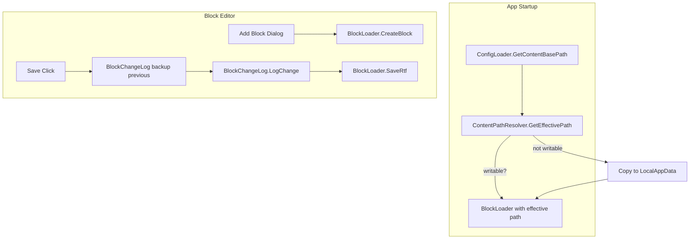

# Block Library Editor Enhancements

## Requirements

1. **Add new blocks** — Create new RTF blocks and metadata from within the editor, not just edit existing ones.
2. **Edit without admin** — Blocks must be writable when content is installed in ProgramData (typically read-only for non-admin users).
3. **Change log with recovery** — Log what was changed; keep last 14 days; support recovery. Rolling window: entries older than 14 days are pruned.

---

## 1. Add New Blocks

### UI Changes ([BlockEditorWindow.xaml](InScope/BlockEditorWindow.xaml))

- Add **"Add Block"** button (e.g. next to the block list or in toolbar).
- Add **"Delete Block"** button (optional, for completeness; confirm before delete).

### New Block Flow

1. User clicks "Add Block".
2. Dialog: enter BlockId (e.g. `elec-005`), select Section (Electrical/Hydraulic/Mechanical).
3. BlockId validation: alphanumeric, hyphen only; must not exist.
4. Create empty RTF file and BlockMetadata JSON.
5. Refresh list, select new block, open in editor.

### Service Changes ([BlockLoader.cs](InScope/Services/BlockLoader.cs))

- Add `CreateBlock(string blockId, string section)`:
  - Create minimal RTF (e.g. `{\rtf1\ansi }` or single empty paragraph).
  - Create `BlockMetadata/{blockId}.json` with `BlockId`, `Section`, `Order` (max existing + 1 for that section, or 999), `Conditions: []`.
  - Return success/failure.
- Add `DeleteBlock(string blockId)` (optional): remove .rtf and .json; return success/failure.
- Ensure Blocks and BlockMetadata directories exist before create (`Directory.CreateDirectory`).

### Add-Block Dialog

- New `AddBlockDialog.xaml` (or inline in BlockEditorWindow): TextBox for BlockId, ComboBox for Section (from config procedureTypes), OK/Cancel.
- Wire from BlockEditorWindow "Add Block" button.

---

## 2. Edit Without Admin

### Problem

Content in `C:\ProgramData\InScope` is not writable by non-admin users. ConfigLoader prefers `./Content` then ProgramData. Portable installs (./Content) are usually writable; installed-to-ProgramData are not.

### Approach: User Content Fallback

When the resolved content path’s Blocks folder is **not writable**, use `%LocalAppData%\InScope\Content` as the writable content location.

- **One-time init**: If primary path is read-only and LocalAppData content doesn’t exist (or is empty), copy full Content folder from primary to LocalAppData (config, Blocks, BlockMetadata).
- **Ongoing**: Use LocalAppData as the content path for the BlockLoader when editing.
- **Main app**: Must load content from the same effective path. So we need a single “effective content path” used by both MainWindow and BlockEditorWindow.

### Implementation

**New service: [ContentPathResolver.cs](InScope/Services/ContentPathResolver.cs)** (or extend ConfigLoader)

- `GetEffectiveContentPath()`: returns the path used for all content operations.
  - Resolve primary path (existing logic: ./Content, then ProgramData).
  - If Blocks folder at primary is writable, return primary.
  - Else, use `%LocalAppData%\InScope\Content`. If it doesn’t exist or is stale, copy from primary (config + Blocks + BlockMetadata).
  - Ensure Blocks and BlockMetadata exist.
- Cache result for the session.

**ConfigLoader / MainWindow**

- Replace `ConfigLoader.GetContentBasePath()` + `Load()` with a call to the resolver so MainWindow and BlockLoader always use the effective path.
- Ensure MainWindow passes the resolved path into BlockLoader and ConfigLoader.Load.

**Flow**

```
Primary path (./Content or ProgramData) → Blocks writable? 
  Yes → use primary
  No  → use LocalAppData\InScope\Content (copy from primary if needed)
```

---

## 3. Change Log with 14-Day Rolling Recovery

### Purpose

- Log each block change (create, modify).
- Retain backups of previous content for recovery.
- Prune log entries and backups older than 14 days.

### New Service: [BlockChangeLog.cs](InScope/Services/BlockChangeLog.cs)

**Storage**

- Log file: `%LocalAppData%\InScope\BlockChangeLog.json`
- Backups: `%LocalAppData%\InScope\BlockBackups\`
  - Format: `{blockId}_{yyyyMMdd_HHmmss}.rtf`

**Log entry schema**

```json
{
  "Timestamp": "2025-03-01T14:30:00Z",
  "BlockId": "elec-001",
  "Action": "Modified",
  "BackupPath": "BlockBackups/elec-001_20250301_143000.rtf"
}
```

- For `Created`: no BackupPath (nothing to back up).
- For `Modified`: BackupPath relative to InScope folder.

**Methods**

- `LogChange(string blockId, string action, string? previousContentOrPath)`: 
  - For Modified: write current file content to BackupPath before overwriting; add entry.
  - For Created: add entry without backup.
  - Prune entries (and backup files) with Timestamp older than 14 days.
- `GetRecentEntries()`: return entries for UI/recovery (optional view).
- `PruneOlderThan(TimeSpan)`: remove log entries and backup files older than 14 days.

**Integration**

- Call `BlockChangeLog.LogChange` from BlockLoader.SaveRtf **before** overwriting (need previous content for backup).
- BlockLoader.SaveRtf should accept an optional callback, or we do backup+log in BlockEditorWindow before calling SaveRtf. Cleaner: BlockLoader.SaveRtf reads current file first (if exists), passes to change log, then saves. Or BlockChangeLog is called from BlockEditorWindow with the previous content we already have in memory.
- Simpler: In BlockEditorWindow Save_Click, before SaveRtf: if file exists, read current content from disk, pass to BlockChangeLog to backup and log; then call SaveRtf. BlockChangeLog handles backup write and log append.

### Pruning Logic

- On each `LogChange`, after appending:
  - Parse full log, filter entries where `Timestamp` < now - 14 days.
  - Delete those backup files.
  - Rewrite log with only recent entries (or remove lines; JSON makes append tricky—use JSON array, read all, add, prune, write).

---

## Key Files


| File                                                                       | Action                                                         |
| -------------------------------------------------------------------------- | -------------------------------------------------------------- |
| [Services/ContentPathResolver.cs](InScope/Services/ContentPathResolver.cs) | New: effective content path with LocalAppData fallback         |
| [Services/BlockChangeLog.cs](InScope/Services/BlockChangeLog.cs)           | New: change log + backups, 14-day prune                        |
| [Services/BlockLoader.cs](InScope/Services/BlockLoader.cs)                 | Add CreateBlock, optionally DeleteBlock; ensure dirs exist     |
| [BlockEditorWindow.xaml](InScope/BlockEditorWindow.xaml)                   | Add "Add Block" button; integrate change log on save           |
| [BlockEditorWindow.xaml.cs](InScope/BlockEditorWindow.xaml.cs)             | Add-block flow; backup+log before save; use effective path     |
| [AddBlockDialog.xaml](InScope/AddBlockDialog.xaml)                         | New: BlockId + Section dialog                                  |
| [AddBlockDialog.xaml.cs](InScope/AddBlockDialog.xaml.cs)                   | New: validation, OK/Cancel                                     |
| [MainWindow.xaml.cs](InScope/MainWindow.xaml.cs)                           | Use ContentPathResolver for base path                          |
| [ConfigLoader.cs](InScope/Services/ConfigLoader.cs)                        | Integrate with ContentPathResolver or refactor path resolution |
| [docs/content-lifecycle.md](InScope/docs/content-lifecycle.md)             | Document add-block, user content fallback, change log          |


---

## Data Flow




---

## Edge Cases

- **BlockId collision**: Validate that new BlockId doesn’t already exist before create.
- **Section from config**: Add-block Section dropdown uses `config.procedureTypes`; ensure config is available in BlockEditorWindow.
- **First run with read-only content**: Copy may take a moment; show status “Preparing editable content…” if needed.
- **Recovery UI**: Optional: add “View change log” or “Recover” in Block Editor to list recent changes and restore from backup. Can be Phase 2.

