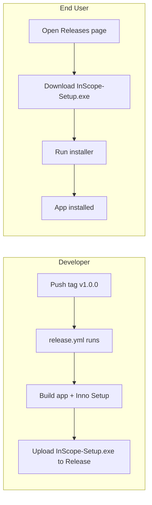

# End-User Download and Install

## Why You Only See Source code (zip)

Your releases "logging" and "new download" use tags `release_2` and `release_1`. The [release.yml](.github/workflows/release.yml) workflow only runs when you push tags matching `**v***` (e.g. `v1.0.0`):

```yaml
on:
  push:
    tags:
      - 'v*'
```

Because `release_1` and `release_2` do not match, the workflow never ran. GitHub automatically adds "Source code (zip)" to every release; the .exe comes only from the workflow.

## Current vs. Desired State


| Asset                 | How it appears                  | Purpose                  |
| --------------------- | ------------------------------- | ------------------------ |
| **Source code (zip)** | Always (GitHub auto-generated)  | For developers only      |
| **InScope-Setup.exe** | Only when release workflow runs | For end users to install |


## How It Works Today




## What to Do

### 1. Create a release with a `v*` tag (required for .exe)

Use a tag that starts with `v` so the workflow runs:

```powershell
git tag v1.0.0
git push origin v1.0.0
```

Within a few minutes, the release workflow will:

1. Build the app
2. Build the InScope-Setup.exe installer
3. Create the release and attach the .exe

After it finishes, the release will show **InScope-Setup.exe** under Assets alongside Source code (zip).

**Note:** If you prefer tags like `release_3`, the workflow can be changed to also match `release_`*. But `v1.0.0` is standard for versioning and works with the UpdateService.

### 2. Add a "For End Users" section to README

Add a prominent section near the top of [README.md](README.md) telling end users to download the installer:

```markdown
## For End Users (Install the app)

1. Go to [Releases](https://github.com/Thomas-TNT/InScope/releases)
2. Download **InScope-Setup.exe** (do not use "Source code (zip)")
3. Run the installer
4. Launch InScope from the Start menu
```

### 3. Optional: Add a portable .zip asset

If you want to offer a **portable** option (InScope.exe + Content folder in a zip, no installer), the release workflow can be extended to also produce and upload `InScope-Portable.zip`. This would give users two choices:

- **InScope-Setup.exe** — installer (adds shortcuts, uninstaller)
- **InScope-Portable.zip** — extract and run; no install

The UpdateService would continue to target InScope-Setup.exe for in-app updates.

---

## Summary

- **Why no .exe:** Tags `release_1` / `release_2` don't match `v`*, so the release workflow never ran
- **Fix:** Push a tag like `v1.0.0` — the workflow will run and attach InScope-Setup.exe
- **README:** Add a "For End Users" section so people know to download the .exe, not the source zip

