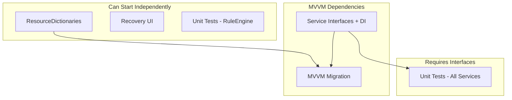

# InScope Phase 2: MVVM, Tests, Styles, Recovery UI

---

## Dependency Overview

---

## 1. ResourceDictionaries for Shared XAML Styles

**Scope:** Extract inline colors and repeated styles into reusable resources.

**Current state:**

- MainWindow.xaml: #0078D4, #666, #ccc, #ddd, #888
- BlockEditorWindow.xaml: #333, #666, #ccc, #ddd, #f5f5f5, #0078D4
- QuestionEditorWindow.xaml: same palette
- App.xaml: empty Application.Resources

**Approach:**

1. Create `Resources/Colors.xaml` — define brush resources:
  - AccentBrush (#0078D4)
  - TextPrimaryBrush (#333)
  - TextSecondaryBrush (#666)
  - BorderBrush (#ccc)
  - SplitterBrush (#ddd)
  - StatusBarBackgroundBrush (#f5f5f5)
  - MutedBrush (#888)
2. Create `Resources/Styles.xaml` — common control styles:
  - StatusBarStyle (shared by MainWindow, BlockEditorWindow, QuestionEditorWindow status areas)
  - ButtonStyle (optional)
  - SectionHeaderStyle (FontWeight SemiBold, Foreground)
3. Merge into App.xaml with ResourceDictionary.MergedDictionaries.
4. Replace inline colors/styles in all XAML with `{StaticResource KeyName}`.

**Verification:** Build, run app, confirm visuals unchanged.

---

## 2. Unit Test Coverage — Full Services

**Prerequisite:** Introduce interfaces for testability (see Section 4).

### 2.1 Easily Testable (No I/O Mock Needed)

| Service                      | What to Test                                             | Approach                                       |
| ---------------------------- | -------------------------------------------------------- | ---------------------------------------------- |
| RuleEngine                   | Empty conditions, AND, OR, unknown question Id, ordering | Unit tests with in-memory metadata and answers |
| UpdateService.IsNewerVersion | Semver comparison                                        | Unit tests with version pairs                  |

### 2.2 Testable with Temp Paths

| Service             | What to Test                                              | Approach                        |
| ------------------- | --------------------------------------------------------- | ------------------------------- |
| ConfigLoader        | Load valid/invalid JSON, BasePath resolution              | Temp directory with config.json |
| ContentPathResolver | GetPrimaryContentPath, IsBlocksWritable                   | Temp dirs                       |
| BlockLoader         | EnumerateBlockIds, LoadMetadata, CreateBlock, DeleteBlock | Temp content folder             |
| BlockChangeLog      | LogChange, GetRecentEntries, PruneAndSave                 | Temp BaseDir                    |

### 2.3 Harder to Test (Integration or Mocked)

| Service                                  | Challenge                            | Approach                                               |
| ---------------------------------------- | ------------------------------------ | ------------------------------------------------------ |
| DocumentAssembler                        | Depends on BlockLoader; FlowDocument | Integration test with temp blocks or mock IBlockLoader |
| PdfExporter / FlowDocumentToPdfConverter | QuestPDF, FlowDocument               | Integration: minimal FlowDocument, verify PDF exists   |
| UpdateService.CheckForUpdateAsync        | HTTP to GitHub                       | Mock HttpClient or Skip for integration                |
| AppLogger                                | File I/O                             | Temp log path or minimal coverage                      |

### 2.4 Test Project Setup

- Add InScope.Tests (xUnit) referencing InScope
- Add dotnet test to .github/workflows/build.yml

---

## 3. Recovery UI for BlockChangeLog Backups

**Scope:** Surface GetRecentEntries() and GetBackupFullPath() so users can browse and restore backups.

**Current APIs (BlockChangeLog.cs):**

- GetRecentEntries() — IReadOnlyList
- GetBackupFullPath(string) — full path for restore
- ChangeEntry: Timestamp, BlockId, Action, BackupPath

**UI Design:**

1. **Entry point:** Help → Recover Block Backup (or File → Recover Block Backup)
2. **RecoveryWindow.xaml:**
  - ListView/DataGrid of recent entries (Timestamp, BlockId, Action)
  - Filter: only entries with BackupPath != null (Modified with backup)
  - Restore button: copy backup to content Blocks folder, overwrite {BlockId}.rtf
  - Open Folder button: open BlockBackups in Explorer
  - Status bar: 14-day retention notice
3. **Restore logic:**
  - ContentPathResolver.GetEffectiveContentPath()
  - Target: {contentPath}/Blocks/{BlockId}.rtf
  - File.Copy(backupFullPath, targetPath, overwrite: true)
  - Confirm overwrite dialog before restore

**Files:** RecoveryWindow.xaml, RecoveryWindow.xaml.cs, menu item in MainWindow

---

## 4. MVVM Migration

**Scope:** Move logic from code-behind to ViewModels; use ICommand and data binding.

**Current state:** 5 windows, all logic in code-behind, no ViewModels.

**Approach:**

### 4.1 Introduce Service Interfaces and DI (Prerequisite)

- IBlockLoader, IRuleEngine, IConfigLoader, IDocumentAssembler, IPdfExporter, IUpdateService, IBlockChangeLog
- ServiceLocator or Microsoft.Extensions.DependencyInjection

### 4.2 Choose MVVM Framework

- CommunityToolkit.Mvvm (ObservableObject, RelayCommand, ObservableProperty)

### 4.3 Migration Order

| Window               | Complexity                                |
| -------------------- | ----------------------------------------- |
| AddBlockDialog       | Low — pilot                               |
| QuestionDialog       | Low                                       |
| QuestionEditorWindow | Medium                                    |
| BlockEditorWindow    | Medium–High (RichTextBox binding caveats) |
| MainWindow           | High                                      |

### 4.4 Per-Window Pattern

1. Create XxxViewModel with properties and commands
2. Replace Click handlers with ICommand
3. Replace code-behind property access with Binding
4. QuestionsPanel: ItemsControl bound to ObservableCollection

### 4.5 RichTextBox

- Document not easily bindable; keep load/save in code-behind or use Behavior

---

## 5. Suggested Execution Order

| Phase | Task                                                                          |
| ----- | ----------------------------------------------------------------------------- |
| A     | ResourceDictionaries                                                          |
| B     | Recovery UI                                                                   |
| C     | InScope.Tests + RuleEngine tests                                              |
| D     | Service interfaces + DI                                                       |
| E     | Unit tests for ConfigLoader, BlockLoader, BlockChangeLog, ContentPathResolver |
| F     | MVVM: AddBlockDialog, QuestionDialog                                          |
| G     | MVVM: QuestionEditorWindow                                                    |
| H     | MVVM: BlockEditorWindow                                                       |
| I     | MVVM: MainWindow                                                              |
| J     | Integration tests (DocumentAssembler, PdfExporter)                            |

**Recommendation:** Start with A and B (independent, immediate value), then C and D.