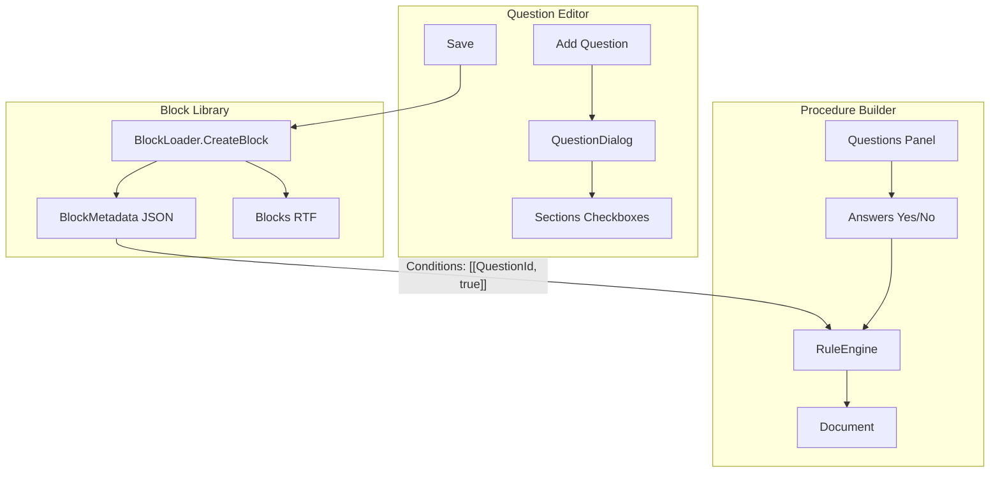

# Question Editor Improvements Plan

## Context

- **Question ID format**: Must match `^[a-zA-Z0-9_\-]+$` (alphanumeric, underscores, hyphens). Examples from config: `HasHighVoltage`, `UsesTransformer`, `InvolvesRotatingEquipment`.
- **Block library**: Blocks live in `Blocks/*.rtf` and `BlockMetadata/*.json`. Each block has `BlockId`, `Section` (procedure type), `Order`, and `Conditions`. BlockLoader.CreateBlock currently creates blocks with empty `Conditions`, so they always show regardless of Yes/No.
- **Procedure builder Yes/No**: [RuleEngine.cs](C:\Users\tteru\OneDrive\Documents\GitHub\InScope\Services\RuleEngine.cs) excludes blocks when `answers[questionId] != expected`. A block with `Conditions: [["UsesPump", true]]` shows only when the user answers Yes. Blocks with empty conditions always show.

---

## 1. Auto-default Question ID

**Problem**: Users must manually enter a Question ID in the correct format.

**Solution**: Derive a default ID from the question text when adding a new question. Pre-fill the field; user can override.

**Implementation**:

- Add `QuestionIdHelper.DeriveFromText(string text)` in a small helper (or in [QuestionViewModel.cs](C:\Users\tteru\OneDrive\Documents\GitHub\InScope\ViewModels\QuestionViewModel.cs)):
  - Split on non-alphanumeric, take words
  - Remove stopwords: "a", "an", "the", "it", "does", "do", "is", "this", "that", "?"
  - PascalCase each word, join (e.g., "Does it use a pump?" -> "UsesPump")
  - Apply same regex as validation; if result invalid, use "Question1" etc.
- In [QuestionViewModel.cs](C:\Users\tteru\OneDrive\Documents\GitHub\InScope\ViewModels\QuestionViewModel.cs):
  - For new questions (`_editQuestion == null`): when `QuestionText` changes, if `QuestionId` is empty or still matches the last derived value, set `QuestionId = DeriveFromText(QuestionText)`. This avoids overwriting user edits.
  - Use `OnPropertyChanged` / partial property to react to `QuestionText` changes.
- Optionally: make the Question ID field read-only for new questions and show the derived value as a hint—but the user asked for a "default", so editable pre-fill is appropriate.

**Files**: [QuestionViewModel.cs](C:\Users\tteru\OneDrive\Documents\GitHub\InScope\ViewModels\QuestionViewModel.cs), optionally a new `QuestionIdHelper.cs` for the derivation logic.

---

## 2. Add Question Blocks to Block Library on Save

**Problem**: Adding a question in the Question Editor does not create corresponding blocks. Users must manually add blocks in the Block Library Editor and configure conditions.

**Solution**: When the user saves in the Question Editor, for each question and for each of its sections (or all procedure types if sections is null), create a block in the block library if it does not already exist. The block will be tied to the question via `Conditions: [[questionId, true]]` (show only when Yes).

**Implementation**:

- Extend [IBlockLoader.cs](C:\Users\tteru\OneDrive\Documents\GitHub\InScope\Services\IBlockLoader.cs) and [BlockLoader.cs](C:\Users\tteru\OneDrive\Documents\GitHub\InScope\Services\BlockLoader.cs):
  - Add overload `CreateBlock(string blockId, string section, IReadOnlyList<object>? conditions = null)`. When `conditions` is provided, use it; otherwise use empty list (preserve existing behavior).
- Inject `IBlockLoader` into [QuestionEditorViewModel](C:\Users\tteru\OneDrive\Documents\GitHub\InScope\ViewModels\QuestionEditorViewModel.cs). The Question Editor is opened from [MainWindow.xaml.cs](C:\Users\tteru\OneDrive\Documents\GitHub\InScope\MainWindow.xaml.cs) which has `_blockLoader`—pass it into `QuestionEditorWindow`.
- In `QuestionEditorViewModel.Save()`:
  - After saving config, for each question in `Questions`:
    - Determine sections: `question.Sections ?? _config.ProcedureTypes`
    - For each section `s`:
      - `blockId = $"{question.Id}-{s}"` (ensures uniqueness across sections)
      - If `!_blockLoader.BlockExists(blockId)`, call `_blockLoader.CreateBlock(blockId, s, conditions: new List<object> { new List<object> { question.Id, true } })`
  - Handle write failures (e.g., read-only Blocks folder) with a status message; do not block config save.

**Block ID convention**: `{QuestionId}-{Section}` (e.g., `UsesPump-Electrical`). Matches existing patterns (section-scoped blocks) and keeps QuestionId prominent.

**Files**: [IBlockLoader.cs](C:\Users\tteru\OneDrive\Documents\GitHub\InScope\Services\IBlockLoader.cs), [BlockLoader.cs](C:\Users\tteru\OneDrive\Documents\GitHub\InScope\Services\BlockLoader.cs), [QuestionEditorViewModel.cs](C:\Users\tteru\OneDrive\Documents\GitHub\InScope\ViewModels\QuestionEditorViewModel.cs), [QuestionEditorWindow.xaml.cs](C:\Users\tteru\OneDrive\Documents\GitHub\InScope\QuestionEditorWindow.xaml.cs), [MainWindow.xaml.cs](C:\Users\tteru\OneDrive\Documents\GitHub\InScope\MainWindow.xaml.cs).

---

## 3. Respect Yes/No on Procedure Builder

**Problem**: Selecting "No" for a question does not remove content tied to that question block.

**Root cause**: Blocks created manually via the Block Library Editor use `CreateBlock(blockId, section)` with no conditions, so `Conditions` is empty. Empty conditions mean the block is always included (see [RuleEngine.cs](C:\Users\tteru\OneDrive\Documents\GitHub\InScope\Services\RuleEngine.cs) and [docs/adr/001-rule-engine-conditions.md](C:\Users\tteru\OneDrive\Documents\GitHub\InScope\docs\adr\001-rule-engine-conditions.md)).

**Solution**: The blocks we create in step 2 will have `Conditions = [["QuestionId", true]]`. The RuleEngine already excludes blocks when the answer does not match; no changes to RuleEngine or MainViewModel are needed. Fixing block creation (step 2) addresses this for new questions.

**If the user added a block manually** before this change: that block has empty conditions and will always show. Options:

- Document that blocks added via the Question Editor get correct conditions; manually added blocks in the Block Library Editor do not (and can be edited in JSON if needed).
- Future enhancement: expose Conditions editing in the Block Library Editor.

---

## Data Flow Diagram

---

## Summary of Changes

| Area                              | Change                                                                       |
| --------------------------------- | ---------------------------------------------------------------------------- |
| QuestionViewModel                 | Derive default QuestionId from QuestionText for new questions; keep editable |
| BlockLoader                       | Add `CreateBlock(blockId, section, conditions)` overload                     |
| QuestionEditorViewModel           | On Save, create blocks for each question/section with `[[questionId, true]]` |
| QuestionEditorWindow / MainWindow | Pass IBlockLoader into Question Editor                                       |
| Procedure Builder                 | No code changes; correct behavior follows from block conditions              |

